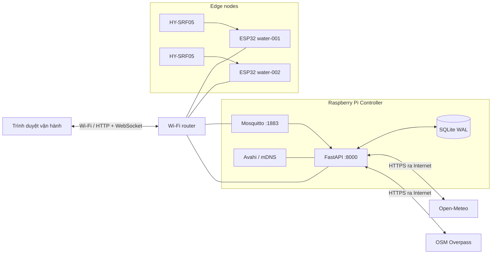
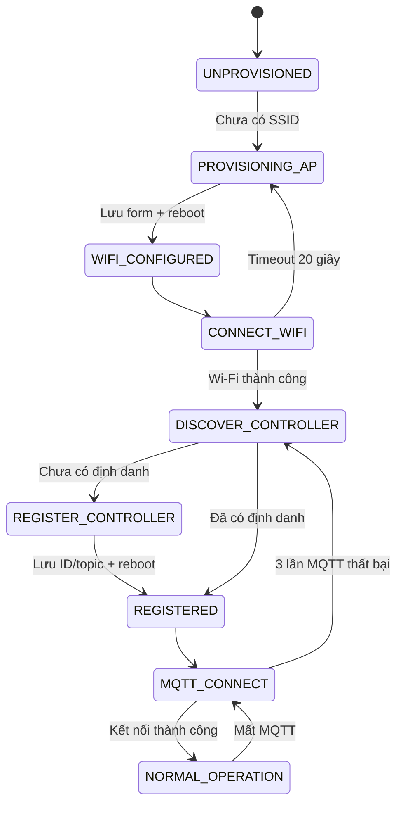
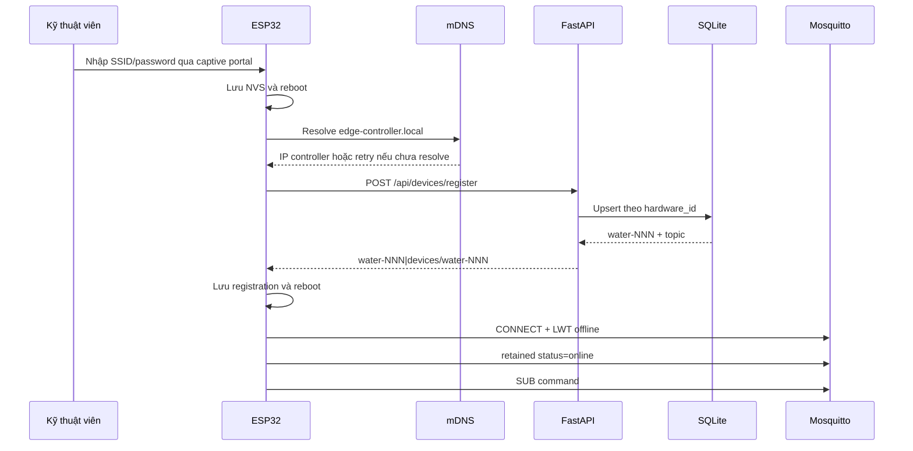
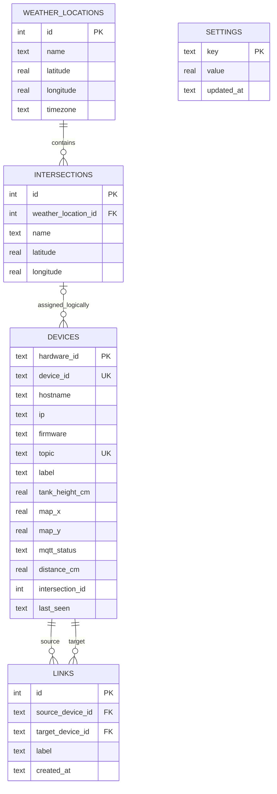

# BÁO CÁO KỸ THUẬT HỆ THỐNG GIÁM SÁT MỰC NƯỚC EDGE IoT

**Tên project:** ESP32 Water Level Edge IoT / Water Controller Node  
**Loại tài liệu:** Báo cáo phân tích, thiết kế và đánh giá kỹ thuật  
**Phiên bản tài liệu:** 1.0  
**Ngày lập:** 16/08/2026  
**Trạng thái:** Báo cáo hiện trạng prototype/MVP  
**Phạm vi đánh giá:** Firmware ESP32, controller, giao diện web, cơ sở dữ liệu và bộ triển khai Raspberry Pi  

> Tài liệu này được lập từ việc đối chiếu trực tiếp mã nguồn và dữ liệu có trong thư mục project tại ngày ghi trên. Các kết quả chưa được kiểm chứng trên phần cứng hoặc Raspberry Pi thật được đánh dấu rõ trong phần kiểm thử.

---

## THÔNG TIN KIỂM SOÁT TÀI LIỆU

| Hạng mục | Nội dung |
|---|---|
| Mã tài liệu | WCN-TR-001 |
| Phiên bản | 1.0 |
| Mức độ hoàn thiện | Baseline kỹ thuật cho MVP |
| Đơn vị/nhóm thực hiện | _Bổ sung khi phát hành chính thức_ |
| Người lập | _Bổ sung khi phát hành chính thức_ |
| Người kiểm tra | _Bổ sung khi phát hành chính thức_ |
| Người phê duyệt | _Bổ sung khi phát hành chính thức_ |

### Lịch sử thay đổi

| Phiên bản | Ngày | Nội dung | Người thực hiện |
|---|---|---|---|
| 1.0 | 16/08/2026 | Lập báo cáo kỹ thuật theo hiện trạng mã nguồn | _Bổ sung_ |

---

## MỤC LỤC

1. Tóm tắt điều hành
2. Giới thiệu project
3. Phạm vi và phương pháp đánh giá
4. Yêu cầu hệ thống
5. Kiến trúc tổng thể
6. Thiết kế phần cứng
7. Thiết kế firmware ESP32
8. Thiết kế controller
9. Giao thức và luồng dữ liệu
10. Thiết kế cơ sở dữ liệu
11. Thiết kế API và giao diện
12. Thuật toán đo và cảnh báo
13. Dịch vụ thời tiết và dữ liệu bản đồ
14. Triển khai Raspberry Pi
15. Khả năng chịu lỗi và vận hành
16. An toàn thông tin
17. Kiểm thử và kết quả xác minh
18. Đánh giá hiện trạng, rủi ro và lộ trình
19. Kết luận
20. Phụ lục

---

## 1. TÓM TẮT ĐIỀU HÀNH

Project xây dựng một hệ thống IoT cục bộ để đo, tổng hợp và trực quan hóa mực nước. Mỗi trạm đo sử dụng ESP32 và cảm biến siêu âm HY-SRF05. Các trạm kết nối Wi-Fi, tự đăng ký với controller, gửi telemetry qua MQTT và vẫn duy trì đo cùng trang trạng thái cục bộ khi controller hoặc broker gián đoạn. Controller sử dụng FastAPI, Mosquitto và SQLite, cung cấp dashboard realtime, hiệu chuẩn chiều cao bể, mô hình liên kết giữa các node, cảnh báo ngập/tắc nghẽn và dự báo mưa theo khu vực Hà Nội.

Kiến trúc triển khai mục tiêu đặt controller trên Raspberry Pi. Pi, các ESP32 và thiết bị vận hành cùng kết nối một Wi-Fi router; Pi chạy Mosquitto và ứng dụng FastAPI dưới `systemd`, quảng bá `edge-controller.local` qua mDNS. Internet chỉ cần cho Open-Meteo và OpenStreetMap; chức năng đo, MQTT, SQLite và dashboard cục bộ vẫn hoạt động khi Internet mất nhưng mạng LAN còn hoạt động.

Mức độ hiện tại phù hợp với **prototype/MVP trong mạng cục bộ tin cậy**. Các chức năng cốt lõi đã có đầy đủ trong mã nguồn: captive provisioning, lưu NVS, đăng ký idempotent, MQTT Last Will, telemetry, WebSocket, hiệu chuẩn, cảnh báo ba mức, quản lý vị trí/giao lộ và bộ cài Raspberry Pi.

Hệ thống **chưa đạt mức production cho mạng không tin cậy** do chưa có xác thực API, chưa mã hóa HTTP/MQTT, Mosquitto cho phép anonymous, mật khẩu AP provisioning của ESP32 được hard-code và các lệnh điều khiển không có cơ chế xác nhận từ thiết bị. Project cũng chưa có test suite tự động, chưa lưu time-series, chưa OTA và chưa có cơ chế quản lý phiên bản schema database.

Tại thời điểm lập báo cáo:

- SQLite vượt qua `integrity_check` và không có lỗi tham chiếu trong `foreign_key_check`.
- Năm module Python chính và hai Bash deployment script vượt qua kiểm tra cú pháp.
- Database demo có 2 node, 1 link, 6 tham số cảnh báo, 12 khu vực thời tiết và 2 giao lộ.
- FastAPI, Mosquitto, mDNS, dashboard và MQTT publish đã được xác minh trên Raspberry Pi.
- Firmware 1.3.0 loại bỏ DHCP gateway fallback vì gateway trên LAN là router.
- Repository lưu deployment SSH public key; private key tương ứng vẫn là artifact cục bộ bị `.gitignore` loại trừ.

---

## 2. GIỚI THIỆU PROJECT

### 2.1 Bài toán

Hệ thống cần theo dõi mực nước tại nhiều điểm phân tán, hiển thị trạng thái tập trung và phát hiện hai nhóm nguy cơ:

- **Ngập tại một điểm:** mực nước tiến gần cảm biến, tương ứng tỷ lệ đầy cao.
- **Tắc nghẽn giữa hai điểm:** chênh lệch mực nước lớn giữa hai node được khai báo có quan hệ dòng chảy.

Dữ liệu cảm biến được bổ sung bằng dự báo lượng mưa theo quận/khu vực để hỗ trợ đánh giá sớm nguy cơ.

### 2.2 Mục tiêu kỹ thuật

1. Cho phép node mới tự cấu hình Wi-Fi mà không cần sửa và nạp lại firmware.
2. Tự nhận dạng phần cứng và đăng ký ổn định với controller.
3. Thu thập khoảng cách siêu âm theo chu kỳ 1 giây.
4. Truyền telemetry và lệnh điều khiển trong mạng LAN qua MQTT.
5. Duy trì đo và web cục bộ khi controller tạm thời không sẵn sàng.
6. Lưu cấu hình, trạng thái mới nhất, topology và ngưỡng trong SQLite.
7. Cập nhật dashboard gần realtime qua WebSocket.
8. Triển khai controller độc lập trên Raspberry Pi dưới dạng appliance cục bộ.

### 2.3 Đối tượng sử dụng

- Kỹ thuật viên lắp đặt node ESP32.
- Người vận hành theo dõi dashboard và cảnh báo.
- Quản trị viên cấu hình ngưỡng, vị trí và liên kết.
- Nhóm phát triển/bảo trì firmware, backend và hạ tầng Pi.

### 2.4 Thuật ngữ

| Thuật ngữ | Ý nghĩa |
|---|---|
| Node/edge node | Một trạm ESP32 gắn cảm biến HY-SRF05 |
| Controller | Ứng dụng FastAPI trung tâm và MQTT bridge |
| Broker | Mosquitto MQTT broker |
| NVS | Non-Volatile Storage trên ESP32 |
| Provisioning | Quá trình nhập Wi-Fi cho node qua captive portal |
| Telemetry | Dữ liệu trạng thái/khoảng cách do node gửi |
| LWT | MQTT Last Will and Testament |
| mDNS | Phân giải hostname `.local` trong mạng cục bộ |
| L0/L1/L2 | Bình thường/Cảnh báo/Nghiêm trọng |

---

## 3. PHẠM VI VÀ PHƯƠNG PHÁP ĐÁNH GIÁ

### 3.1 Thành phần được đánh giá

| Thành phần | Đường dẫn | Quy mô chính |
|---|---|---:|
| Firmware ESP32 | `esp32/water_edge_node/water_edge_node.ino` | 743 dòng |
| FastAPI controller | `controller/main.py` | 577 dòng |
| Registry/SQLite | `controller/device_registry.py` | 524 dòng |
| Weather/Overpass | `controller/weather_service.py` | 397 dòng |
| Validation model | `controller/models.py` | 95 dòng |
| mDNS advertiser | `controller/mdns_service.py` | 119 dòng |
| Dashboard web | `controller/static/` | HTML/CSS/JavaScript thuần |
| Triển khai Pi | `deploy/pi/` | installer, service, broker config và verify |

### 3.2 Phương pháp

- Đọc và đối chiếu trực tiếp mã nguồn.
- Kiểm tra schema, số lượng bản ghi, tính toàn vẹn và khóa ngoại của SQLite.
- Kiểm tra cú pháp năm module Python bằng `py_compile`.
- Kiểm tra cú pháp `install.sh` và `verify.sh` bằng `bash -n`.
- Đối chiếu tài liệu `README.md`, `controller/README.md` và `deploy/pi/README.md` với implementation.
- Kiểm tra trạng thái listener cục bộ và khả năng gọi `/health`.
- Không thay đổi firmware, database nghiệp vụ hoặc cấu hình triển khai trong quá trình đánh giá.

### 3.3 Ngoài phạm vi xác minh thực nghiệm

- Độ chính xác thực tế của HY-SRF05 trong môi trường nước, hơi ẩm và nhiễu bề mặt.
- Khả năng chịu tải khi có số lượng lớn node/WebSocket client.
- Khả năng hoạt động dài hạn trên Raspberry Pi thật.
- Chất lượng vùng phủ Wi-Fi router ngoài hiện trường.
- End-to-end với ESP32, Mosquitto và Open-Meteo/Overpass trong phiên đánh giá này.

---

## 4. YÊU CẦU HỆ THỐNG

### 4.1 Yêu cầu chức năng và mức đáp ứng

| ID | Yêu cầu | Hiện trạng |
|---|---|---|
| FR-01 | Đo khoảng cách bằng HY-SRF05 mỗi giây | Đã triển khai |
| FR-02 | Mở AP/captive portal khi chưa có Wi-Fi | Đã triển khai |
| FR-03 | Lưu Wi-Fi và định danh vào NVS | Đã triển khai |
| FR-04 | Tìm controller qua mDNS `edge-controller.local` | Đã triển khai |
| FR-05 | Đăng ký idempotent theo hardware ID | Đã triển khai |
| FR-06 | Gửi status và distance qua MQTT | Đã triển khai |
| FR-07 | Nhận `measure_now`, `restart`, `wifi_reset`, `factory_reset` | Đã triển khai |
| FR-08 | Cung cấp web trạng thái trực tiếp trên node | Đã triển khai |
| FR-09 | Hiển thị dashboard tập trung gần realtime | Đã triển khai |
| FR-10 | Hiệu chuẩn chiều cao và tính phần trăm đầy | Đã triển khai |
| FR-11 | Tạo link có hướng và cảnh báo chênh lệch | Đã triển khai |
| FR-12 | Cấu hình ngưỡng L0/L1/L2 toàn mạng | Đã triển khai |
| FR-13 | Theo dõi dự báo mưa 12 quận Hà Nội | Đã triển khai |
| FR-14 | Tìm/lưu/gán giao lộ OpenStreetMap cho node | Đã triển khai |
| FR-15 | Tự khởi động controller trên Raspberry Pi | Có script, chưa xác minh trên Pi trong phiên này |
| FR-16 | Lưu lịch sử telemetry/time-series | Chưa triển khai |
| FR-17 | Gửi/thông báo cảnh báo ra kênh ngoài | Chưa triển khai |
| FR-18 | OTA firmware | Chưa triển khai |

### 4.2 Yêu cầu phi chức năng

| Nhóm | Yêu cầu mục tiêu | Đánh giá hiện trạng |
|---|---|---|
| Sẵn sàng | Node vẫn đo khi controller/MQTT mất | Đáp ứng ở mức firmware loop |
| Khôi phục | Tự retry Wi-Fi, discovery, registration, MQTT | Đã có timer/reconnect |
| Tính nhất quán | Một hardware ID ánh xạ ổn định đến một device ID | Có unique key và đăng ký idempotent |
| Realtime | Dashboard nhận snapshot qua WebSocket | Đã có; polling 10 giây làm fallback |
| Bền vững dữ liệu | Registry/config không mất khi restart | SQLite WAL; mới lưu latest state |
| Bảo mật | Xác thực, phân quyền, mã hóa | Chưa đáp ứng production |
| Bảo trì | Module hóa và cấu hình qua environment | Khá tốt ở controller; firmware vẫn là một sketch |
| Kiểm thử | Có unit/integration/HIL test tự động | Chưa có |
| Quan sát | Health, serial log, journal | Có mức cơ bản; chưa có metrics/tracing |

---

## 5. KIẾN TRÚC TỔNG THỂ

### 5.1 Sơ đồ logic



### 5.2 Phân lớp

| Lớp | Thành phần | Trách nhiệm |
|---|---|---|
| Cảm nhận | HY-SRF05 | Phát/thu siêu âm, trả thời gian echo |
| Edge | ESP32 | Đo, provisioning, lưu cấu hình, discovery, MQTT, local web |
| Messaging | Mosquitto | Trao đổi telemetry, status và command |
| Application | FastAPI | API, validation, alert engine, MQTT bridge, WebSocket |
| Persistence | SQLite | Identity, latest telemetry, settings, topology, vị trí |
| Presentation | HTML/CSS/JS | Dashboard, settings, weather management |
| External data | Open-Meteo, OSM Overpass | Dự báo, geocoding và dữ liệu đường/giao lộ |
| Infrastructure | Wi-Fi router, Avahi, systemd | LAN/DHCP, mDNS và service lifecycle |

### 5.3 Topology mạng mục tiêu

| Hạng mục | Giá trị |
|---|---|
| SSID vận hành | SSID Wi-Fi router của địa điểm |
| Kết nối Pi | Wi-Fi LAN, IP do router cấp |
| Gateway | Router Wi-Fi, không phải controller |
| Controller discovery | `edge-controller.local` qua mDNS |
| Dashboard mDNS | `water_monitor.local`, `water-monitor.local` |
| HTTP controller | TCP 8000 |
| MQTT | TCP 1883 |
| Local web ESP32 | TCP 80 |
| Internet uplink | Chính Wi-Fi router hoặc Ethernet nếu có |

---

## 6. THIẾT KẾ PHẦN CỨNG

### 6.1 Thành phần

| Thiết bị | Vai trò |
|---|---|
| ESP32 | Xử lý edge, Wi-Fi, HTTP, MQTT, NVS và mDNS |
| HY-SRF05 | Cảm biến khoảng cách siêu âm |
| Raspberry Pi | Controller trung tâm trên Wi-Fi LAN |
| Mạch hạ áp/level shifter | Bảo vệ GPIO nhận echo 3,3 V |
| Nguồn 5 V ổn định | Cấp nguồn cảm biến và board theo thiết kế thực tế |

### 6.2 Sơ đồ đấu nối hiện tại

```text
ESP32 GPIO33  -------->  HY-SRF05 TRIG
ESP32 GPIO32  <--------  Mạch chia áp/level shifter <-------- HY-SRF05 ECHO
ESP32 GND     ---------  HY-SRF05 GND
Nguồn 5 V     ---------  HY-SRF05 VCC
```

HY-SRF05 có thể xuất ECHO ở mức 5 V trong khi GPIO ESP32 làm việc ở 3,3 V. Không được nối trực tiếp ECHO vào GPIO32. Mạch hạ mức phải bảo đảm điện áp đầu vào GPIO nằm trong giới hạn cho phép của board thực tế.

### 6.3 Nguyên lý đo

Firmware tạo xung TRIG 10 µs và đo độ rộng xung ECHO bằng `pulseIn` với timeout 30.000 µs:

```text
distance_cm = echo_duration_us × 0,0343 / 2
```

Hệ số 0,0343 cm/µs là tốc độ âm thanh quy ước; phép chia 2 tương ứng hành trình đi và về. Implementation chưa bù nhiệt độ/độ ẩm, chưa lọc trung vị và chưa kiểm tra biên theo dải danh định của cảm biến.

### 6.4 Yêu cầu lắp đặt thực địa

- Cảm biến cần hướng vuông góc mặt nước, tránh thành bể và vật cản trong vùng phát.
- Khoảng cách khi bể đầy vẫn phải lớn hơn vùng mù của cảm biến.
- Vỏ hộp và đầu nối cần phù hợp môi trường ẩm; project hiện chưa định nghĩa chuẩn IP.
- Dây ECHO cần đi qua mạch hạ mức; GND phải dùng chung.
- Chiều cao bể nhập trên dashboard phải là khoảng cách tham chiếu từ vị trí sensor đến đáy/mốc 0 mong muốn.

---

## 7. THIẾT KẾ FIRMWARE ESP32

### 7.1 Phiên bản và thư viện

| Hạng mục | Giá trị |
|---|---|
| Firmware khai báo | `1.3.0` |
| Serial | 115200 baud |
| Thư viện ngoài | PubSubClient |
| Thư viện ESP32 core | WiFi, WebServer, DNSServer, Preferences, HTTPClient, ESPmDNS |
| NVS namespace | `water-iot` |

### 7.2 Các module/lớp

| Lớp | Chức năng |
|---|---|
| `ConfigManager` | Đọc/ghi NVS, hardware ID, Wi-Fi, registration, reset |
| `SensorManager` | Điều khiển TRIG/ECHO và tính khoảng cách |
| `ProvisioningServer` | SoftAP, DNS wildcard, captive portal và form lưu Wi-Fi |
| `WiFiConnectionManager` | Kết nối lúc boot và duy trì reconnect |
| `ControllerDiscovery` | Resolve mDNS `edge-controller.local` |
| `ControllerClient` | Đăng ký HTTP với FastAPI |
| `MQTTManager` | Kết nối, LWT, subscribe command, publish telemetry |
| `LocalWebServer` | Trang trạng thái, JSON `/status`, local factory reset |

### 7.3 Máy trạng thái



Enum trạng thái phục vụ theo dõi/log; logic runtime chủ yếu được điều phối bởi các cờ cấu hình, trạng thái Wi-Fi/MQTT và timer `millis()`.

### 7.4 Provisioning

- Khi chưa có SSID hoặc Wi-Fi lưu sẵn không kết nối trong 20 giây, node mở AP `WaterSensor-Setup`.
- IP SoftAP: `192.168.4.1/24`.
- Mật khẩu hiện tại: `12345678` được hard-code.
- DNS wildcard trả mọi hostname về `192.168.4.1`; người dùng truy cập `http://water.local` hoặc captive portal tự mở.
- SSID giới hạn 32 ký tự; password tối đa 64 ký tự, rỗng hoặc tối thiểu 8 ký tự.
- Password không được ghi ra Serial.
- Lưu thành công sẽ reboot thiết bị.

### 7.5 Định danh

- `hardware_id`: 12 ký tự hex in hoa sinh từ eFuse MAC.
- Trước đăng ký: hostname tạm `water-<4 ký tự cuối hardware ID>`.
- Sau đăng ký: controller cấp `water-NNN`; firmware lưu `deviceId` và `mqttTopic` vào NVS.
- Hostname chính thức: `<deviceId>.local`, ví dụ `water-001.local`.
- `wifi_reset` chỉ xóa SSID/password và giữ registration.
- `factory_reset` xóa toàn bộ namespace `water-iot` và Wi-Fi credentials.

### 7.6 Chu kỳ và retry

| Tham số | Giá trị |
|---|---:|
| Timeout Wi-Fi lúc boot | 20 giây |
| Retry Wi-Fi | 15 giây |
| Timeout mDNS | 2 giây |
| Retry discovery | 10 giây |
| Retry registration | 15 giây |
| Retry MQTT | 5 giây |
| Chu kỳ đo | 1 giây |
| Ngưỡng publish | 1,0 cm |
| MQTT socket timeout | 3 giây |
| MQTT buffer | 512 byte |

### 7.7 Đo và publish

Mỗi giây firmware đo một lần. Giá trị timeout được coi là invalid, không cập nhật `lastDistanceCm` và không thay baseline. Giá trị hợp lệ đầu tiên được publish khi MQTT sẵn sàng. Sau đó chỉ publish nếu:

```text
abs(distance_current - distance_published_baseline) >= 1,0 cm
```

Command `measure_now` đo và publish ngay, bỏ qua ngưỡng thay đổi. Thiết kế giảm lưu lượng nhưng có hệ quả: nếu mực nước thay đổi chậm dưới 1 cm mỗi bước và dao động quanh baseline, dữ liệu trung tâm chỉ cập nhật khi tổng độ lệch đạt ngưỡng.

### 7.8 Web cục bộ

| Endpoint | Chức năng |
|---|---|
| `GET /` | Trang trạng thái live |
| `GET /status` | Hardware ID, device ID, hostname, IP, RSSI, MQTT và khoảng cách |
| `POST /factory-reset` | Xóa NVS/Wi-Fi rồi reboot |

Trang `/` gọi `/status` mỗi giây. Các endpoint hiện không có authentication.

---

## 8. THIẾT KẾ CONTROLLER

### 8.1 Công nghệ

| Thành phần | Công nghệ |
|---|---|
| Web/API | FastAPI `>=0.115,<1.0` |
| ASGI server | Uvicorn `>=0.30,<1.0` |
| MQTT client | Paho MQTT `>=2.1,<3.0` |
| mDNS | Zeroconf `>=0.147,<1.0` |
| Database | SQLite chuẩn Python, WAL mode |
| Frontend | HTML/CSS/JavaScript thuần |

FastAPI khai báo phiên bản ứng dụng `2.5.0`. User-Agent trong weather service còn ghi `2.2`, còn firmware là `1.2.1`; cần chuẩn hóa chiến lược version khi phát hành.

### 8.2 Lifecycle ứng dụng

Khi khởi động, controller:

1. Khởi tạo MQTT client chạy network loop riêng.
2. Quảng bá mDNS trong thread riêng.
3. Tự bổ sung 12 quận nội thành Hà Nội nếu thiếu.
4. Tải dự báo thời tiết.
5. Tạo background task refresh định kỳ.
6. Phục vụ FastAPI, static UI và WebSocket.

Khi dừng, task thời tiết bị cancel, mDNS được unregister và MQTT client disconnect.

### 8.3 MQTT bridge

Controller subscribe:

```text
devices/+/status
devices/+/distance_cm
```

Message hợp lệ được parse theo đúng ba segment `devices/<device_id>/<metric>`. Registry chỉ nhận:

- `status`: `online` hoặc `offline`.
- `distance_cm`: số thực trong khoảng `0..100000`.

Sau khi cập nhật SQLite, controller lập snapshot dashboard mới và broadcast qua WebSocket.

### 8.4 Dashboard socket

`DashboardSockets` giữ tập connection đang mở. Mỗi biến động MQTT, cấu hình, topology hoặc weather có thể tạo một broadcast toàn bộ snapshot. Client lỗi được loại khỏi tập connection. Đây là thiết kế đơn giản, phù hợp số node/client nhỏ; chưa có batching, backpressure hoặc delta update.

### 8.5 Cấu hình environment

| Biến | Mặc định | Ý nghĩa |
|---|---|---|
| `WATER_DB_PATH` | `controller/data/water_controller.db` | Đường dẫn SQLite |
| `WATER_MQTT_HOST` | `127.0.0.1` | MQTT broker |
| `WATER_MQTT_PORT` | `1883` | Cổng MQTT |
| `WATER_MQTT_CLIENT_ID` | `water-controller-node` | MQTT client ID |
| `WATER_MDNS_ENABLED` | `true` | Bật quảng bá mDNS |
| `WATER_MDNS_HOSTNAMES` | 3 alias mặc định | Danh sách hostname web |
| `WATER_MDNS_ADDRESS` | Tự dò LAN IP | IPv4 quảng bá |
| `WATER_HTTP_PORT` | `8000` | Port trong service record |
| `WATER_AUTO_LOAD_HANOI_DISTRICTS` | `true` | Tự nạp 12 quận |
| `WATER_WEATHER_REFRESH_SECONDS` | `900` | Chu kỳ forecast |
| `WATER_WEATHER_HTTP_TIMEOUT` | `10` | Timeout HTTP thường |
| `WATER_OVERPASS_URL` | overpass-api.de | Overpass chính |
| `WATER_OVERPASS_FALLBACK_URL` | overpass.private.coffee | Overpass dự phòng |
| `WATER_OVERPASS_USER_AGENT` | Chuỗi định danh project | User-Agent request |

---

## 9. GIAO THỨC VÀ LUỒNG DỮ LIỆU

### 9.1 Đăng ký node



Request đăng ký được Pydantic kiểm tra chặt: hardware ID phải khớp `[0-9A-F]{12}`, hostname kết thúc `.local`, IP hợp lệ, type dài 1–64 và firmware dài 1–32. Controller bỏ qua hostname do node gửi và tự tạo hostname chuẩn từ device ID.

### 9.2 MQTT topic và semantics

| Hướng | Topic | Payload | Retain | QoS thực tế |
|---|---|---|---|---|
| ESP32 → Broker | `devices/<id>/status` | `online`/`offline` | Có | QoS 0 |
| ESP32 → Broker | `devices/<id>/distance_cm` | Số thập phân 1 chữ số | Không | QoS 0 |
| Controller → ESP32 | `devices/<id>/command` | Chuỗi command | Không | Hiệu lực end-to-end hiện là QoS 0* |

`status=offline` là LWT retained. Khi kết nối thành công, ESP32 publish `online` retained.

\* Controller publish command với QoS 1, nhưng firmware subscribe bằng hàm mặc định QoS 0. MQTT phân phối theo mức thấp hơn giữa publish và subscription, nên delivery tới node không được bảo đảm ở QoS 1. Controller chỉ biết broker đã nhận publish, không biết firmware đã thực thi.

### 9.3 Command

| Command | Tác dụng |
|---|---|
| `measure_now` | Đo và gửi ngay nếu echo hợp lệ |
| `restart` | Reboot node |
| `wifi_reset` | Xóa riêng Wi-Fi, giữ device ID/topic |
| `factory_reset` | Xóa toàn bộ NVS và Wi-Fi, reboot về setup AP |

### 9.4 Luồng realtime dashboard

```text
HY-SRF05 → ESP32 → MQTT → MQTTBridge → SQLite latest state
                                      └→ dashboard_payload()
                                         └→ WebSocket → Browser

Browser ── GET /api/dashboard mỗi 10 giây ──> fallback khi WebSocket gián đoạn
```

---

## 10. THIẾT KẾ CƠ SỞ DỮ LIỆU

### 10.1 Cấu hình SQLite

- `PRAGMA foreign_keys = ON` trên connection của ứng dụng.
- `PRAGMA journal_mode = WAL`.
- Một connection dùng `check_same_thread=False` và bảo vệ bằng `threading.RLock`.
- Chưa có `schema_version`, migration framework hoặc backup định kỳ trong runtime.

### 10.2 Mô hình dữ liệu



`devices.intersection_id` được bổ sung bằng `ALTER TABLE` và được ứng dụng duy trì như quan hệ logic; schema hiện tại không khai báo foreign key vật lý cho cột này. Code chủ động gỡ liên kết trước khi xóa intersection/location.

### 10.3 Bảng `devices`

- Khóa chính: `hardware_id`.
- Unique: `device_id`, `topic`.
- Lưu identity, firmware, IP, tên hiển thị, chiều cao, tọa độ canvas, vị trí thực và telemetry gần nhất.
- Device ID mới được tạo theo `max(số hiện có) + 1`, định dạng ba chữ số tối thiểu.
- Đăng ký lại cùng hardware ID chỉ cập nhật IP, type, firmware và timestamp; giữ ID, label, hiệu chuẩn, vị trí và links.

### 10.4 Bảng `links`

- Link có hướng từ source đến target.
- Cặp source/target là unique; tạo lại sẽ cập nhật label.
- Cấm self-link bằng cả Pydantic và CHECK constraint.
- Hai foreign key cascade khi xóa device.

### 10.5 Bảng `settings`

Sáu giá trị mặc định:

| Key | Mặc định |
|---|---:|
| `blockage_level1_cm` | 5,0 |
| `blockage_level2_cm` | 10,0 |
| `flood_level1_percent` | 70,0 |
| `flood_level2_percent` | 90,0 |
| `rain_level1_6h_mm` | 10,0 |
| `rain_level2_6h_mm` | 30,0 |

Database đang khảo sát đã đổi ngưỡng blockage thành 10/20 cm; các ngưỡng còn lại bằng mặc định.

### 10.6 Weather locations và intersections

- `weather_locations` unique theo cặp latitude/longitude.
- `intersections` unique theo location + latitude + longitude.
- Xóa weather location cascade intersections và gỡ vị trí khỏi device.
- Xóa intersection gỡ `intersection_id` khỏi device trước khi xóa.

### 10.7 Giới hạn persistence

- Chỉ lưu **giá trị telemetry mới nhất**, không có lịch sử.
- Không có bảng command/audit/event/alert history.
- Không có retention policy.
- Không có migration version; thay đổi schema được thực hiện trực tiếp lúc startup.
- Cách dùng connection hiện tại phù hợp một process Uvicorn. Không nên chạy nhiều worker vì sẽ tạo nhiều MQTT client cùng ID, nhiều task weather và nhiều connection quản lý độc lập.

---

## 11. THIẾT KẾ API VÀ GIAO DIỆN

### 11.1 API thiết bị và hệ thống

| Method | Path | Chức năng | Mã lỗi chính |
|---|---|---|---|
| POST | `/api/devices/register` | Đăng ký/upsert node | 422 validation |
| GET | `/api/devices` | Danh sách node | — |
| PATCH | `/api/devices/{device_id}` | Label, chiều cao, canvas, intersection | 400/404/422 |
| POST | `/api/devices/{device_id}/wifi-reset` | Gửi `wifi_reset` | 404/409/503 |
| DELETE | `/api/devices/{device_id}` | Gửi factory reset rồi xóa node/link | 404/409/503 |
| GET | `/api/links` | Danh sách links | — |
| POST | `/api/links` | Tạo/upsert link | 400/404/422 |
| DELETE | `/api/links/{id}` | Xóa link | 404 |
| GET | `/api/settings` | Đọc ngưỡng | — |
| PUT | `/api/settings` | Cập nhật toàn bộ sáu ngưỡng | 422 |
| GET | `/api/dashboard` | Snapshot tổng hợp | — |
| WS | `/ws` | Snapshot realtime | — |
| GET | `/health` | Health MQTT, mDNS, weather và DB path | — |

### 11.2 API weather và vị trí

| Method | Path | Chức năng |
|---|---|---|
| GET | `/api/weather/geocode?q=` | Geocode trong phạm vi Hà Nội |
| GET | `/api/weather/locations` | Danh sách khu vực |
| POST | `/api/weather/locations` | Thêm/upsert khu vực |
| DELETE | `/api/weather/locations/{id}` | Xóa khu vực |
| GET | `/api/weather` | Forecast cache và trạng thái stale/error |
| POST | `/api/weather/refresh` | Refresh thủ công |
| GET | `/api/intersections/search` | Tìm giao lộ dọc tuyến phố |
| GET | `/api/intersections/discover` | Khám phá toàn bộ giao lộ có tên quanh quận |
| GET | `/api/intersections` | Danh mục đã lưu, có thể lọc location |
| POST | `/api/intersections` | Lưu/upsert giao lộ |
| DELETE | `/api/intersections/{id}` | Xóa và gỡ khỏi node |

FastAPI tự cung cấp OpenAPI/Swagger tại `/docs` dù route này không được khai báo thủ công.

### 11.3 Validation nổi bật

- Request cấm field dư bằng `extra="forbid"`.
- Label tối đa 80 ký tự.
- Chiều cao bể `>0` và `<=100000` cm.
- Vị trí canvas: x `2..98`, y `4..96`.
- L2 luôn phải lớn hơn L1 ở cả blockage, flood và rain.
- Flood threshold giới hạn `0..100%`.
- Device ID trong link phải khớp `water-[0-9]+`.

### 11.4 Giao diện web

| Trang | Chức năng |
|---|---|
| `/` | Tổng node, online, mực nước trung bình, cảnh báo, topology, cấu hình node/link |
| `/settings` | Cấu hình ba nhóm ngưỡng L0/L1/L2 |
| `/weather` | Forecast 12 khu vực và quản lý giao lộ |

Dashboard dùng JavaScript thuần, escape dữ liệu trước khi chèn HTML, kết nối WebSocket và tự reconnect sau 2 giây. Polling `/api/dashboard` mỗi 10 giây là fallback. Node có thể kéo trên canvas; vị trí được lưu bằng phần trăm để co giãn theo viewport.

---

## 12. THUẬT TOÁN ĐO VÀ CẢNH BÁO

### 12.1 Chuyển khoảng cách thành mực nước

HY-SRF05 đo từ vị trí sensor xuống mặt nước:

```text
raw_water_level_cm = tank_height_cm - distance_cm
water_level_cm     = clamp(raw_water_level_cm, 0, tank_height_cm)
fill_percent       = water_level_cm / tank_height_cm × 100
```

Node thiếu `distance_cm` hoặc `tank_height_cm` được coi là `uncalibrated` và không sinh flood alert.

### 12.2 Cảnh báo ngập

| Điều kiện | Mức | Trạng thái |
|---|---:|---|
| `fill_percent >= flood_L2` | 2 | `critical` |
| `flood_L1 <= fill_percent < flood_L2` | 1 | `warning` |
| `fill_percent < flood_L1` | 0 | `normal` |
| Chưa đủ dữ liệu/hiệu chuẩn | — | `uncalibrated` |

### 12.3 Cảnh báo blockage

Với link có hướng A → B:

```text
level_delta_cm = water_level_A - water_level_B
blockage_metric = abs(level_delta_cm)
```

| Điều kiện | Mức |
|---|---:|
| `blockage_metric >= blockage_L2` | 2 |
| `blockage_L1 <= blockage_metric < blockage_L2` | 1 |
| `blockage_metric < blockage_L1` | 0 |

Nếu hai node chưa cùng được hiệu chuẩn, alert là `uncalibrated`. UI có thể hiển thị chênh lệch distance để tham khảo, nhưng không dùng distance delta để phát blockage alert.

### 12.4 Cảnh báo mưa

```text
rain_6h_mm = tổng precipitation của 6 phần tử dự báo giờ đầu tiên
```

So sánh `rain_6h_mm` với `rain_level1_6h_mm` và `rain_level2_6h_mm` để tạo L0/L1/L2.

### 12.5 Tổng hợp alert

`dashboard_payload()` tập hợp flood alert của device, blockage alert của link và rain alert của khu vực; chỉ L1/L2 được đưa vào danh sách active alerts. Danh sách được sắp theo level giảm dần. Hiện không có debounce, hysteresis hay acknowledgement, nên giá trị quanh ngưỡng có thể làm trạng thái dao động.

---

## 13. DỊCH VỤ THỜI TIẾT VÀ DỮ LIỆU BẢN ĐỒ

### 13.1 Open-Meteo

- Tự bootstrap 12 quận nội thành Hà Nội.
- Tối đa 3 request geocode đồng thời lúc bootstrap.
- Nếu geocoding không trả kết quả, dùng tọa độ fallback cố định trong code.
- Forecast gồm nhiệt độ, độ ẩm, precipitation, rain, weather code, xác suất và hourly 24 giờ.
- Chu kỳ mặc định 900 giây.
- Khi refresh lỗi và đã có forecast cũ, snapshot đánh dấu `stale=true` và giữ cache.
- Cache forecast chỉ nằm trong RAM; sau restart và mất Internet, dữ liệu dự báo cũ không còn.

### 13.2 OpenStreetMap Overpass

- Tìm các `way` có highway thuộc trunk/primary/secondary/tertiary/unclassified/residential và có tên.
- Phạm vi là bounding box ±0,04 độ quanh tâm quận, không phải ranh giới hành chính chính xác.
- Một giao lộ được nhận diện tại node thuộc tối thiểu hai way có tên khác nhau.
- Các điểm cùng tên gần nhau trong sai số ±0,00045 độ được gom cụm.
- Request được tuần tự hóa, cách nhau ít nhất 2 giây.
- Timeout query 25 giây cho search và 60 giây cho discovery; HTTP POST cho phép tối thiểu 75 giây.
- Tự thử instance dự phòng nếu instance chính lỗi.
- Cache giao lộ nằm trong RAM, tối đa 100 key theo cơ chế loại phần tử đầu tiên.

### 13.3 Hạn chế dữ liệu địa lý

- Bounding box có thể lấy dữ liệu ngoài quận hoặc bỏ sót phần quận xa tâm.
- Kết quả phụ thuộc độ đầy đủ và cách đặt tên đường trên OSM.
- Hai đoạn đường cùng tên hoặc nút giao phức tạp có thể bị gom/nhân bản.
- Chưa có kiểm tra point-in-polygon theo ranh giới hành chính.
- Các dịch vụ ngoài không có SLA do project kiểm soát.

---

## 14. TRIỂN KHAI RASPBERRY PI

### 14.1 Nền tảng mục tiêu

- Raspberry Pi OS Lite 64-bit.
- Raspberry Pi kết nối cùng Wi-Fi router với các ESP32.
- Router phải cho phép client giao tiếp và multicast mDNS; không dùng Guest Wi-Fi/client isolation.
- Pi nhận IP bằng DHCP; operator ưu tiên mDNS thay vì hard-code địa chỉ.

### 14.2 Quy trình cài tự động

`install.sh` thực hiện:

1. Cài Python, venv, pip, Mosquitto, clients, Avahi, curl, Git và OpenSSH server.
2. Tạo system user `watercontroller` không có login shell.
3. Cài app vào `/opt/water-controller`, quyền thư mục 0750.
4. Tạo venv và cài `requirements.txt`.
5. Cấu hình Mosquitto listen `0.0.0.0:1883`, anonymous.
6. Cài deployment public key vào `authorized_keys` của SSH user.
7. Đặt hostname Pi `edge-controller`.
8. Cài/enable `water-controller.service` và các service phụ thuộc.

Installer không tạo, xóa hoặc thay đổi access point/Wi-Fi profile của Pi.

### 14.3 systemd service

| Thuộc tính | Giá trị |
|---|---|
| User/group | `watercontroller` |
| Working directory | `/opt/water-controller` |
| ExecStart | Uvicorn bind `0.0.0.0:8000` |
| Restart | `on-failure`, sau 5 giây |
| UMask | `0027` |
| Requires | `mosquitto.service` |
| mDNS address | Tự phát hiện theo IP LAN hiện tại |

Python Zeroconf trên Pi quảng bá hai alias dashboard. Hostname `edge-controller.local` do hostname hệ thống và Avahi đảm nhiệm.

### 14.4 Git deployment và dữ liệu

Raspberry Pi clone source trực tiếp từ Git rồi chạy `deploy/pi/install.sh`.
Installer mặc định giữ database đang có trên Pi. Repository lưu thêm
`water_controller.demo.db` để phục hồi snapshot 2 node/1 link khi cần. Khi
`WATER_REPLACE_DATABASE=1`, database cũ được backup vào
`/var/backups/water-controller/<timestamp>` trước khi thay.

Public key `deploy/pi/ssh/water-controller-deploy.pub` được installer thêm vào
`authorized_keys`; private key tương ứng không nằm trong Git.

### 14.5 Xác minh sau cài đặt

`verify.sh` kiểm tra:

- SSH, Mosquitto, Avahi và Water Controller đang active.
- Pi có địa chỉ IPv4 LAN.
- `/health` phản hồi.
- Mosquitto nhận publish cục bộ.
- `edge-controller.local` resolve được cục bộ.
- In các địa chỉ IPv4 và địa chỉ dashboard.

Script chưa kiểm tra subscribe round-trip, database writable, mDNS resolution từ client, WebSocket hoặc một ESP32 thật.

---

## 15. KHẢ NĂNG CHỊU LỖI VÀ VẬN HÀNH

### 15.1 Tình huống và phản ứng

| Sự cố | Phản ứng hiện tại | Nhận xét |
|---|---|---|
| Wi-Fi lưu sẵn sai khi boot | Sau 20 giây về provisioning AP | Khôi phục tại chỗ được |
| Wi-Fi rớt khi đang chạy | Reconnect mỗi 15 giây | Sensor loop vẫn chạy |
| mDNS controller lỗi | Retry mỗi 10 giây | Không kết nối nhầm vào DHCP gateway/router |
| MQTT lỗi | Retry 5 giây; sau 3 lần re-resolve controller | Có self-recovery |
| FastAPI/MQTT controller dừng | ESP32 vẫn đo/local web; telemetry không được buffer | Mất dữ liệu trong thời gian gián đoạn |
| Internet mất | Sensor/controller cục bộ hoạt động; weather dùng cache RAM nếu có | Không ảnh hưởng đo trực tiếp |
| Echo timeout | Bỏ sample, giữ last valid/baseline | Tránh publish giá trị lỗi |
| WebSocket rớt | Browser reconnect 2 giây; polling 10 giây | Có fallback |
| Weather provider lỗi | Giữ forecast cũ và đánh dấu stale | Cache mất khi restart process |
| Overpass chính lỗi | Thử server dự phòng | Có fallback ngoài hệ thống |

### 15.2 Quan sát và nhật ký

- ESP32 log theo prefix `[BOOT]`, `[CONFIG]`, `[STATE]`, `[WIFI]`, `[CONTROLLER]`, `[REGISTER]`, `[MQTT]`, `[SENSOR]`, `[WEB]`.
- Pi dùng `journalctl -u water-controller` và `journalctl -u mosquitto`.
- `/health` trả trạng thái MQTT, mDNS, weather và đường dẫn database.
- Chưa có Prometheus metrics, structured logging, log rotation riêng, alert delivery hoặc correlation ID.

### 15.3 Sao lưu và phục hồi

Hiện mới có backup tự động khi installer được yêu cầu thay database. Chưa có lịch backup định kỳ. Với SQLite WAL, bản sao an toàn phải checkpoint qua SQLite API hoặc dừng `water-controller.service` trước khi copy. Quy trình restore snapshot demo đã được ghi trong README.

---

## 16. AN TOÀN THÔNG TIN

### 16.1 Mô hình tin cậy hiện tại

Hệ thống giả định Wi-Fi LAN là mạng tin cậy. Mô hình này phù hợp thử nghiệm kín nhưng không phù hợp khi người lạ có thể vào mạng, khi port được route ra ngoài hoặc khi Pi dùng chung với hệ thống khác.

### 16.2 Phát hiện chính

| ID | Mức | Phát hiện | Hệ quả |
|---|---|---|---|
| SEC-01 | Thấp | Repository phân phối SSH public key dùng chung cho deployment | Cần quản lý/thu hồi key trong `authorized_keys` khi kết thúc project |
| SEC-02 | Cao | Mosquitto `allow_anonymous true`, không TLS | Giả mạo telemetry, gửi lệnh reset/restart |
| SEC-03 | Cao | Toàn bộ API/controller không authentication/authorization | Người trong LAN có thể sửa/xóa node, link, ngưỡng |
| SEC-04 | Cao | HTTP và WebSocket không TLS | Có thể nghe lén/chỉnh sửa trong mạng không tin cậy |
| SEC-05 | Cao | `POST /factory-reset` trên node không xác thực | Bất kỳ client cùng mạng có thể xóa cấu hình node |
| SEC-06 | Trung bình | Setup AP dùng mật khẩu hard-code `12345678` | Dễ truy cập thiết bị đang provisioning |
| SEC-07 | Trung bình | Command không ký và không có device acknowledgement | Không chứng minh được lệnh do controller hợp lệ gửi/đã thực thi |
| SEC-08 | Trung bình | Không rate limit | Dễ bị spam API, WebSocket, Overpass hoặc command |
| SEC-09 | Trung bình | Dependency chỉ pin theo khoảng version, không lock/hash | Build sau này có thể khác và tăng supply-chain risk |
| SEC-10 | Thấp | `/health` lộ đường dẫn database | Lộ thông tin cấu trúc hệ thống |

### 16.3 Kiểm soát tích cực đã có

- App Pi chạy dưới system user riêng, không dùng root.
- UMask 0027; file app và database được cài với quyền hạn chế.
- Request body được Pydantic validate và cấm field dư.
- SQL dùng parameter binding; phần tên cột động chỉ lấy từ allow-list nội bộ.
- Frontend escape dữ liệu khi render HTML.
- Wi-Fi password không ghi vào Serial.
- Installer chỉ cài public key; private key bị `.gitignore` loại trừ.

### 16.4 Khuyến nghị ưu tiên

1. Giữ private SSH key ngoài repository, giới hạn quyền file và thu hồi public key khỏi Pi khi kết thúc project.
2. Bật MQTT username/password riêng từng node hoặc certificate; cấu hình ACL chỉ cho phép đúng topic của node.
3. Thêm HTTPS và WSS, tối thiểu qua reverse proxy cục bộ.
4. Thêm đăng nhập, role operator/admin và CSRF protection cho các thao tác thay đổi.
5. Dùng provisioning secret duy nhất theo thiết bị hoặc one-time code.
6. Thiết kế command envelope có `command_id`, timestamp/nonce, chữ ký hoặc MAC và topic acknowledgement.
7. Thêm rate limit, audit log và firewall giới hạn truy cập từ subnet LAN cần thiết.

---

## 17. KIỂM THỬ VÀ KẾT QUẢ XÁC MINH

### 17.1 Kết quả đã thực hiện ngày 16/08/2026

| ID | Kiểm tra | Kết quả | Ghi chú |
|---|---|---|---|
| T-01 | `py_compile` 5 module Python chính | PASS | Không phát hiện lỗi cú pháp |
| T-02 | `bash -n` cho `install.sh`, `verify.sh` | PASS | Không phát hiện lỗi cú pháp |
| T-03 | SQLite `PRAGMA integrity_check` | PASS | Trả `ok` |
| T-04 | SQLite `PRAGMA foreign_key_check` | PASS | 0 dòng vi phạm |
| T-05 | Kiểm tra FastAPI 8000 và Mosquitto 1883 trên Pi | PASS | Service active |
| T-06 | Gọi `http://127.0.0.1:8000/health` trên Pi | PASS | MQTT/mDNS/weather/database OK |
| T-07 | Biên dịch firmware 1.3.0 | PASS | Flash 78%, RAM 15% |
| T-08 | SQLite demo snapshot | PASS | 2 node, 1 link, integrity `ok` |
| T-09 | Markdown link/code fence | PASS | Không có link nội bộ hỏng |

### 17.2 Snapshot dữ liệu hiện tại

| Đối tượng | Số lượng |
|---|---:|
| Devices | 2 |
| Links | 1 |
| Settings | 6 |
| Weather locations | 12 |
| Intersections đã lưu | 2 |

Hai device trong database demo đều khai báo firmware `1.0.0`, trong khi source firmware hiện tại là `1.3.0`. Cả hai có trạng thái lưu gần nhất là `offline`. Đây là dấu hiệu snapshot chứa node chưa nâng cấp hoặc chưa đăng ký lại sau khi nâng cấp.

### 17.3 Ma trận kiểm thử nghiệm thu đề xuất

| ID | Kịch bản | Tiêu chí đạt |
|---|---|---|
| AT-01 | Flash sạch và boot | Mở `WaterSensor-Setup`, portal truy cập được |
| AT-02 | Provision Wi-Fi đúng | Lưu NVS, reboot, nhận DHCP IP |
| AT-03 | Wi-Fi sai | Sau 20 giây quay lại setup AP |
| AT-04 | mDNS hoạt động | Resolve `edge-controller.local` và đăng ký |
| AT-05 | mDNS lỗi | Không gọi nhầm router; retry cho đến khi Pi được resolve |
| AT-06 | Đăng ký hai lần cùng hardware ID | Nhận cùng device ID/topic |
| AT-07 | MQTT connect/disconnect | Retained online và LWT offline đúng |
| AT-08 | Đo ổn định | Sample 1 giây; không publish khi lệch <1 cm |
| AT-09 | Echo timeout | Không ghi/publish giá trị invalid |
| AT-10 | `measure_now` | Publish ngay sample hợp lệ |
| AT-11 | `wifi_reset` | Mở setup AP, giữ ID/vị trí/link |
| AT-12 | `factory_reset` | Xóa NVS, mở setup AP, registry/link bị xóa theo luồng quản trị |
| AT-13 | Hiệu chuẩn | Công thức level/fill đúng tại biên 0%, L1, L2, 100% |
| AT-14 | Link alert | Dùng trị tuyệt đối delta và đúng L0/L1/L2 |
| AT-15 | WebSocket mất/kết nối lại | UI reconnect và polling fallback |
| AT-16 | FastAPI/MQTT outage | Node vẫn đo; tự reconnect khi dịch vụ trở lại |
| AT-17 | Mất Internet | Dashboard sensor vẫn dùng; weather báo stale/error |
| AT-18 | Reboot Pi | Pi nối lại Wi-Fi và toàn bộ service tự lên |
| AT-19 | Backup/restore | Khôi phục database giữ ID/link/settings |
| AT-20 | Soak test 72 giờ | Không memory leak, deadlock, mất reconnect |

### 17.4 Kiểm thử cần bổ sung trước pilot

- Unit test cho `_device_dict`, `_link_dict`, threshold boundary và Pydantic models.
- Integration test API với database tạm.
- MQTT integration test có broker thật và kiểm tra retained/LWT.
- Hardware-in-the-loop cho ESP32/HY-SRF05.
- Test nhiễu, mặt nước dao động, bọt, mưa trực tiếp và condensation.
- Load test số node/client dự kiến.
- Security test cho auth, ACL, reset command và input abuse sau khi hardening.

---

## 18. ĐÁNH GIÁ HIỆN TRẠNG, RỦI RO VÀ LỘ TRÌNH

### 18.1 Điểm mạnh

- Luồng provisioning đến dashboard hoàn chỉnh và dễ demo.
- Định danh idempotent giúp giữ cấu hình khi node đổi IP/Wi-Fi.
- Firmware tách lớp rõ, retry không chặn ở steady state.
- Có LWT, local web, mDNS retry và WebSocket fallback.
- SQLite schema đủ cho inventory, topology, cấu hình và vị trí MVP.
- Controller tích hợp dữ liệu mưa và giao lộ có cache/fallback.
- Bộ triển khai Pi quan tâm tới user riêng, backup trước replace và integrity check.

### 18.2 Rủi ro kỹ thuật

| ID | Mức | Rủi ro | Xử lý đề xuất |
|---|---|---|---|
| R-01 | Thấp | Deployment public key dùng chung | Theo dõi fingerprint và thu hồi khi kết thúc project |
| R-02 | Cao | Lệnh MQTT không có ACK thiết bị; thao tác xóa chờ cố định 0,5 giây | Command/ACK state machine, timeout và retry idempotent |
| R-03 | Cao | Không auth/TLS/ACL | Hardening trước khi mở rộng mạng |
| R-04 | Cao | Không lưu lịch sử; outage làm mất telemetry | Buffer edge + bảng time-series/TSDB |
| R-05 | Cao | Chưa có test tự động | Tạo test pyramid và CI |
| R-06 | Trung bình | Alert dao động quanh ngưỡng | Hysteresis, debounce và minimum duration |
| R-07 | Trung bình | Ultrasonic chưa lọc/bù môi trường | Median filter, range check, calibration và quality flag |
| R-08 | Trung bình | Online status không có TTL ở controller | Tính offline theo `last_seen` timeout |
| R-09 | Trung bình | Schema migration không version | Alembic hoặc migration table tuần tự |
| R-10 | Trung bình | Gói deploy hiện rỗng | Dừng controller, chạy lại package và kiểm tra checksum |
| R-11 | Trung bình | Version backend/weather/firmware không đồng bộ | Chính sách semantic version + build metadata |
| R-12 | Trung bình | Bounding box quận không chính xác | Dùng polygon hành chính hoặc geofencing |
| R-13 | Thấp | Snapshot broadcast toàn bộ mỗi message | Debounce/coalesce và delta update khi scale |
| R-14 | Thấp | Workspace không phải Git repository | Đưa vào version control, tag release và lưu changelog |

### 18.3 Lộ trình đề xuất

#### Giai đoạn 0 — Khóa baseline và xử lý khẩn cấp

- Giữ private SSH key ngoài source và rà soát toàn bộ secret.
- Duy trì `.gitignore` cho private key, `.venv`, log, `__pycache__`, SQLite journal và archive.
- Clone repository trực tiếp trên Pi và xác nhận `install.sh` có thể tái lập deployment.
- Đồng bộ firmware node lên 1.3.0 và xác nhận registration qua mDNS trên LAN.

#### Giai đoạn 1 — Pilot tin cậy

- Thêm unit/API/MQTT tests và HIL smoke test.
- Bổ sung median filter, giới hạn dải đo, sample quality và sensor fault.
- Thêm `last_seen` TTL, alert hysteresis và event log.
- Thiết lập backup/restore định kỳ và log rotation.
- Thực hiện soak test trên Pi và test mất điện/mạng.

#### Giai đoạn 2 — Hardening

- MQTT authentication, per-device ACL, TLS nếu phạm vi mạng yêu cầu.
- API authentication, role, CSRF, audit và rate limit.
- Command ID + ACK + trạng thái pending/succeeded/failed.
- Unique provisioning credential và quy trình onboard/offboard.

#### Giai đoạn 3 — Production/scale

- Lưu time-series, retention/downsampling và export dữ liệu.
- OTA có ký số và rollback.
- Metrics, dashboard vận hành, cảnh báo ra SMS/email/app tùy yêu cầu.
- Watchdog, brownout strategy, remote diagnostics và fleet inventory.
- Load/capacity model theo số node và tần suất telemetry thực tế.

### 18.4 Tiêu chí sẵn sàng đề xuất

| Mốc | Điều kiện tối thiểu |
|---|---|
| Demo | Chạy đủ AT-01 đến AT-16 trong LAN kín |
| Pilot | Không còn risk nghiêm trọng; test tự động cốt lõi; soak 72 giờ; backup restore đạt |
| Production nội bộ | Auth/ACL, ACK command, monitoring, history và quy trình vận hành |
| Mạng không tin cậy | TLS, phân quyền, secret lifecycle, hardening và security test hoàn tất |

---

## 19. KẾT LUẬN

Project đã hình thành một MVP end-to-end có kiến trúc hợp lý cho bài toán giám sát mực nước cục bộ. Ranh giới trách nhiệm giữa edge node, MQTT, controller, database và dashboard tương đối rõ. Các cơ chế provisioning, tự khám phá controller, đăng ký idempotent, local fallback và triển khai Raspberry Pi tạo nền tảng tốt cho pilot.

Tuy vậy, hiện trạng cần được phát hành đúng nhãn **MVP/prototype trên mạng tin cậy**, chưa nên coi là production. Những việc có ưu tiên cao nhất là xử lý secret, tạo lại gói deploy hợp lệ, nâng node lên firmware hiện hành, bổ sung kiểm thử tự động, xác nhận trên Pi/ESP32 thật và thiết kế lại đường lệnh điều khiển có acknowledgement. Sau đó mới tiến hành hardening MQTT/API, lưu lịch sử và OTA.

Nếu hoàn thành các hạng mục Giai đoạn 0 và 1, hệ thống có thể bước vào pilot có kiểm soát. Để vận hành lâu dài hoặc triển khai tại khu vực công cộng, bắt buộc hoàn thành hardening và quan sát hệ thống theo Giai đoạn 2–3.

---

## 20. PHỤ LỤC

### Phụ lục A — Cấu trúc project

```text
arduino/
├── README.md
├── BAO_CAO_KY_THUAT.md
├── esp32/
│   └── water_edge_node/
│       └── water_edge_node.ino
├── controller/
│   ├── main.py
│   ├── models.py
│   ├── device_registry.py
│   ├── weather_service.py
│   ├── mdns_service.py
│   ├── requirements.txt
│   ├── data/
│   │   └── water_controller.db
│   └── static/
│       ├── index.html
│       ├── app.js
│       ├── settings.html
│       ├── settings.js
│       ├── weather.html
│       ├── weather.js
│       └── styles.css
└── deploy/
    └── pi/
        ├── install.sh
        ├── verify.sh
        ├── water-controller.service
        └── mosquitto-water-controller.conf
```

### Phụ lục B — Cổng và endpoint vận hành

| Dịch vụ | Port | URL/topic mẫu |
|---|---:|---|
| Dashboard | 8000/TCP | `http://water-monitor.local:8000/` |
| Settings | 8000/TCP | `http://water-monitor.local:8000/settings` |
| Weather | 8000/TCP | `http://water-monitor.local:8000/weather` |
| Health | 8000/TCP | `http://edge-controller.local:8000/health` |
| Swagger | 8000/TCP | `http://edge-controller.local:8000/docs` |
| MQTT | 1883/TCP | `devices/#` |
| ESP32 local web | 80/TCP | `http://water-001.local/` |
| Provisioning | 80/TCP | `http://192.168.4.1/` hoặc `http://water.local/` |

### Phụ lục C — Checklist bàn giao

- [ ] Điền người lập/kiểm tra/phê duyệt và mã phát hành.
- [ ] Xác minh Git chỉ chứa SSH public key; private key vẫn ở ngoài project.
- [ ] Tạo `.gitignore` và repository có kiểm soát phiên bản.
- [ ] Biên dịch firmware 1.3.0 đúng board profile.
- [ ] Chạy unit/integration tests.
- [ ] Chạy đầy đủ ma trận nghiệm thu trên ESP32/Pi thật.
- [ ] Clone Git trên Pi và chạy lại `deploy/pi/install.sh` từ trạng thái sạch.
- [ ] Kiểm tra nội dung archive không chứa key, log, venv hoặc dữ liệu ngoài ý muốn.
- [ ] Ghi lại SSID LAN, serial number, MAC và vị trí lắp từng node trong hồ sơ riêng.
- [ ] Kiểm tra backup và phục hồi SQLite.
- [ ] Phê duyệt risk acceptance nếu vẫn vận hành anonymous MQTT/API.
- [ ] Tag phiên bản firmware/backend và lưu release notes.

### Phụ lục D — Tài liệu nguồn nội bộ

- `README.md`: tổng quan, provisioning, MQTT và test end-to-end.
- `controller/README.md`: controller, API, cảnh báo, weather và intersections.
- `deploy/pi/README.md`: đóng gói, cài đặt, cutover và xác minh Raspberry Pi.
- Mã nguồn trong `controller/`, `esp32/` và `deploy/pi/` là nguồn sự thật kỹ thuật chính của báo cáo.
